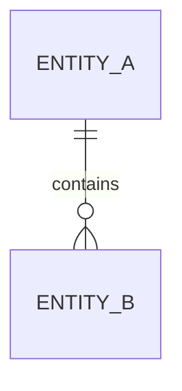

# 领域与数据库设计

## 设计信息

| 字段 | 内容 |
|---|---|
| 关联需求基线 |  |
| 设计层级 | 概念/逻辑/物理 |
| 新建或改造 |  |
| 数据库及版本 | 未确认 |
| 租户/组织隔离 | 未确认 |
| 设计状态 | 候选/DBA已确认 |

## 技术约束与开放项

| 编号 | 内容 | 影响 | 确认角色 | 状态 |
|---|---|---|---|---|
| `OPEN-DB-001` |  |  | 研发/DBA | 待确认 |

## 领域实体

| 实体编号 | 名称 | 职责 | 所有者/组织 | 生命周期 | 敏感等级 | 关联需求 | 来源 |
|---|---|---|---|---|---|---|---|
| `ENT-001` |  |  |  |  |  | `REQ-001` |  |

## 实体关系

| 上游实体 | 关系 | 下游实体 | 基数 | 生效与历史规则 | 来源 |
|---|---|---|---|---|---|
|  |  |  |  |  |  |

## ER图



## 逻辑表设计

### `TBL-001`：表名

- 关联实体：`ENT-001`
- 关联需求：`REQ-001`
- 数据归属与隔离：
- 生命周期与删除：
- 主要查询：

| 字段 | 类型建议 | 必填 | 默认值 | 主/外键 | 唯一/检查约束 | 敏感与加密 | 说明及来源 |
|---|---|---|---|---|---|---|---|
| `id` |  | 是 |  | PK |  |  |  |

## 索引建议

| 表 | 索引字段及顺序 | 唯一 | 支撑的查询/排序 | 选择理由 | 待验证事项 |
|---|---|---|---|---|---|
|  |  |  |  |  |  |

## 迁移、回填与回滚

| 步骤 | 动作 | 兼容方式 | 校验 | 回滚 | 风险 |
|---|---|---|---|---|---|
|  |  |  |  |  |  |

## 候选DDL

仅在数据库类型、版本、现有结构和约束已确认时填写。不得自动执行。

```sql
-- candidate only
```

## 需求—数据追踪

| 需求 | 实体 | 表/字段 | 数据任务 | 覆盖状态 |
|---|---|---|---|---|
| `REQ-001` | `ENT-001` | `TBL-001` |  |  |

## Gate B：研发/DBA评审

| 评审项 | 结论 | 修改意见 | 确认人 |
|---|---|---|---|
| 实体与关系 |  |  |  |
| 表与约束 |  |  |  |
| 权限、隔离与敏感数据 |  |  |  |
| 索引与容量 |  |  |  |
| 迁移与回滚 |  |  |  |
